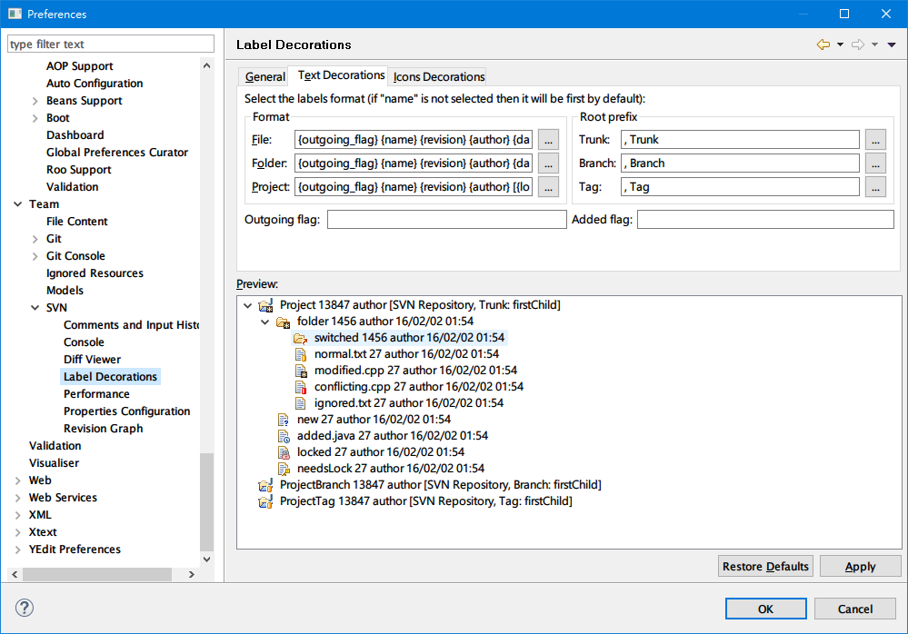
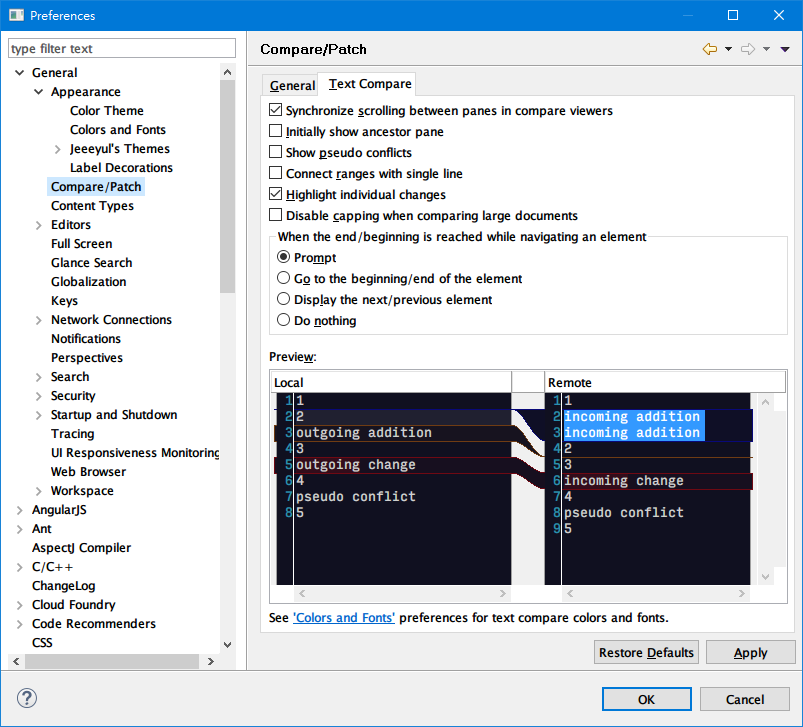
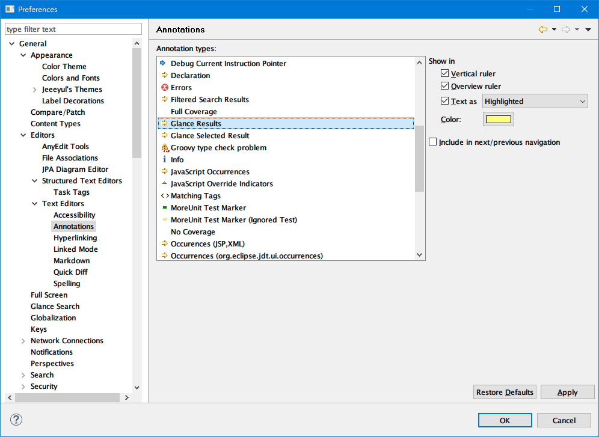

# Eclipse Preference #
Here highlights important settings for coding productivity. You can quick go to the setting by input some words in the filter text field.

#### Fonts and Colors
To customize the editor fonts and colors.

#### Editor Quick Diff
You must turn on this feature so that you can see the current changes (based on the working copy base) highlighted in the overview ruler.

#### Common Text Editor

#### SVN Label Decorations

#### Workspace

### Local History

#### Text Compare View Settings

#### Editor Annotations

#### SVN Label Decorations

#### Shortcut/Hot Keys

#### Java Templates (Snippets)

