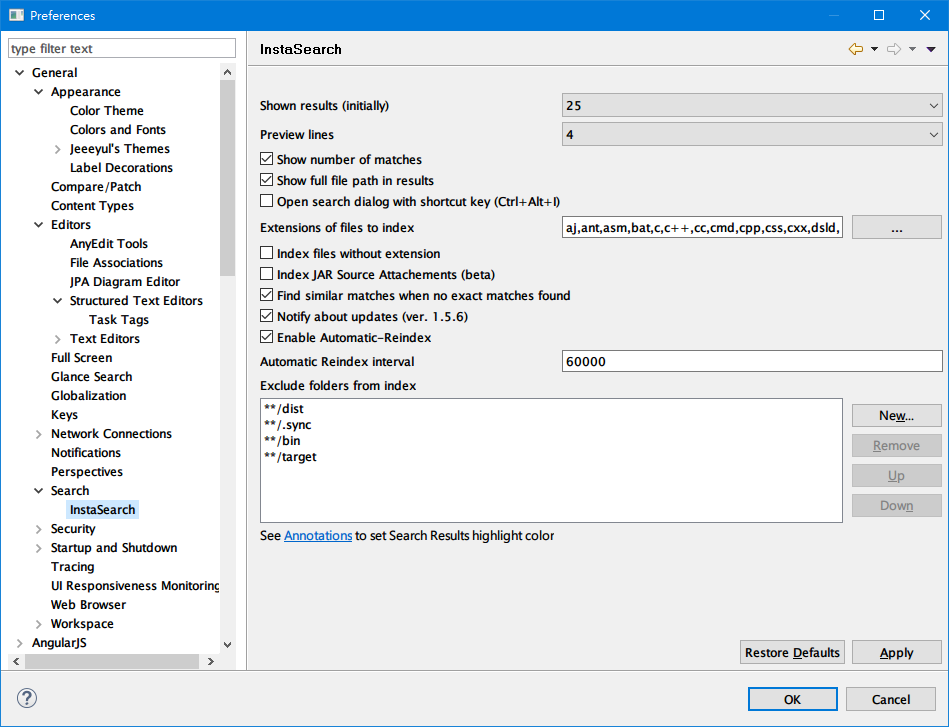
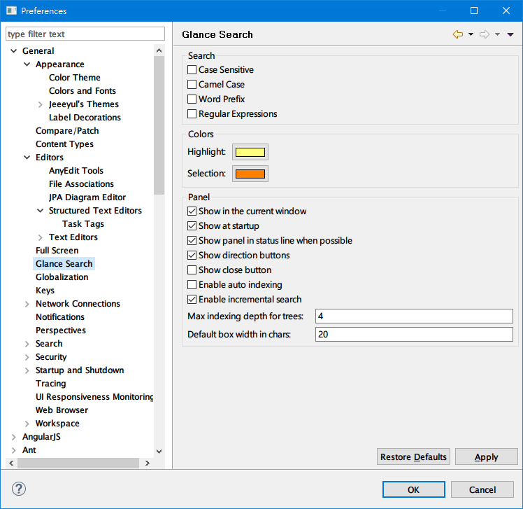
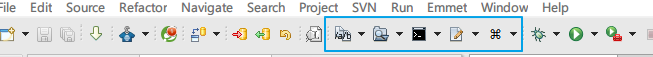
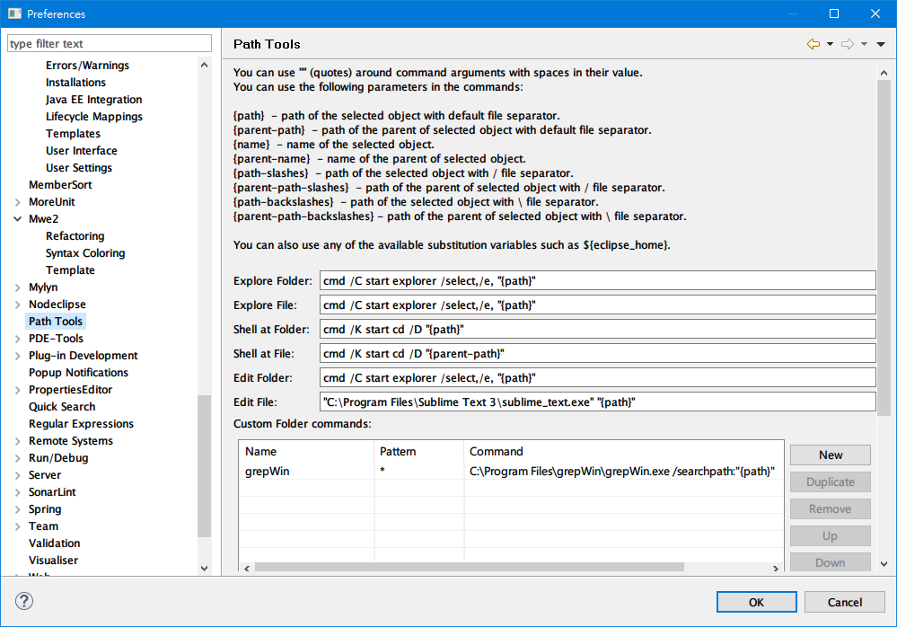
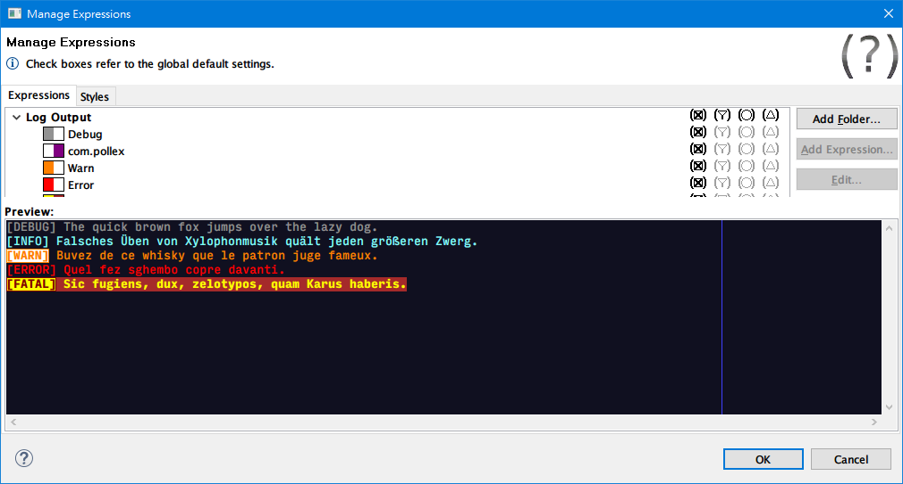
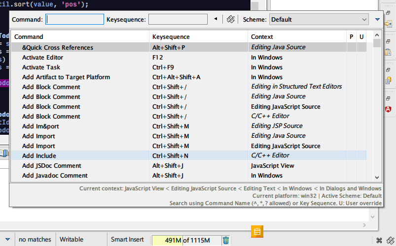
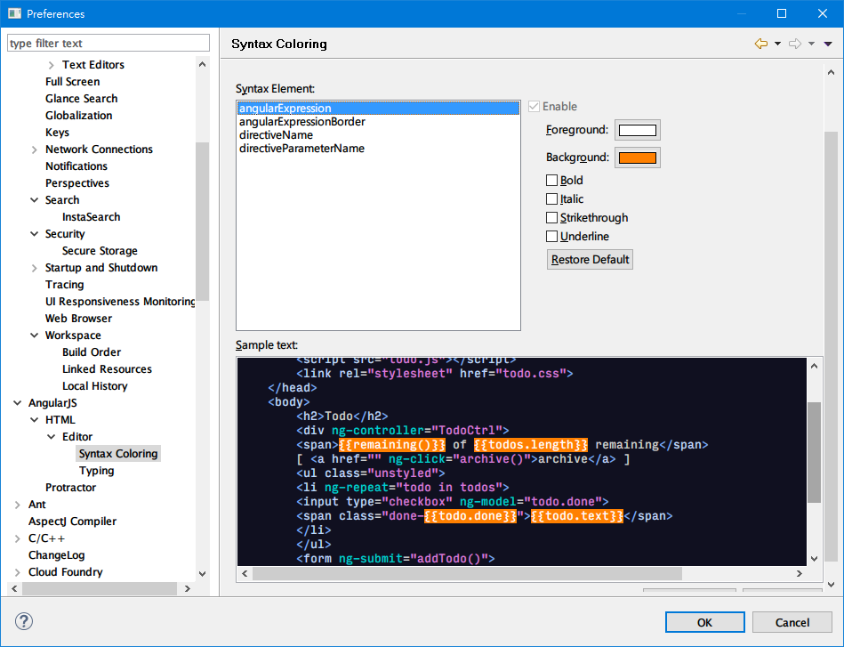
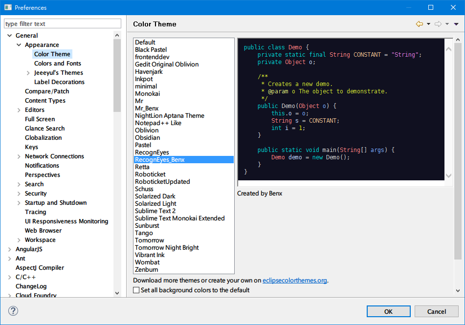
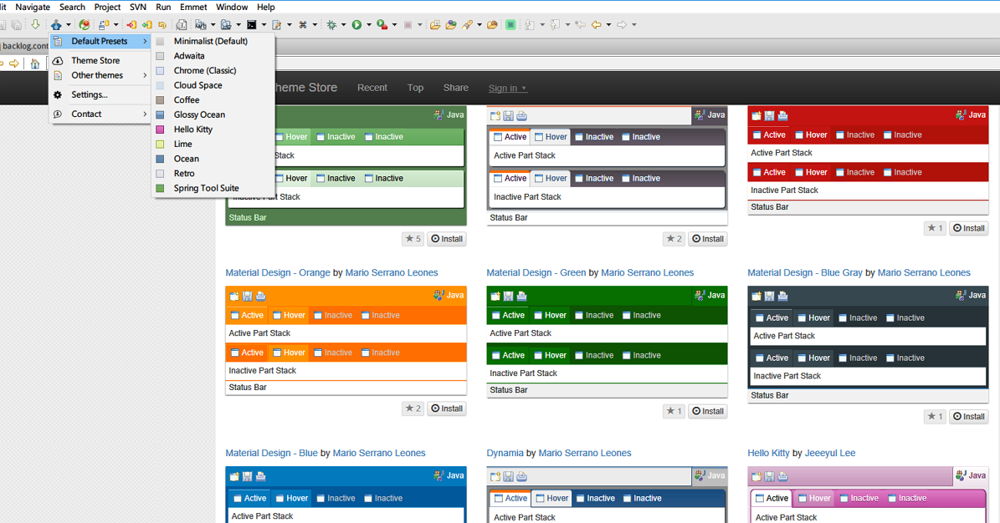

**Table of Contents**  *generated with [DocToc](http://doctoc.herokuapp.com/)*

- [InstaSearch](#)
- [Glance](#)
- [Path Tools](#)
- [Grep Console](#)
- [Command Key Binding Reference](#)
- [AngularJS Eclipse](#)
- [Eclipse Color Theme](#)
- [Jeeeyuls UI Theme](#)
- [Other Plugins](#)

#### InstaSearch
InstaSearch will build indexes for your workspace projects, so you can quick search/fuzzy find to files. http://marketplace.eclipse.org/content/instasearch

#### Glance
Find string in the current file with highlighted. http://marketplace.eclipse.org/content/glance

#### Path Tools
Utilities to quick show in Explorer, command line window, and open with custom/external tool. http://marketplace.eclipse.org/content/path-tools

#### Grep Console
Make console message colorful and read easier. http://marketplace.eclipse.org/content/grep-console

Sharing [My Grep Console Setting](settings/grep_console_settings). You may download and import the file.

#### Command Key Binding Reference
Easy to find out binding keys by command name or hot-key input. http://marketplace.eclipse.org/content/command-key-binding-cross-reference

#### AngularJS Eclipse
Make Angular development easier in Eclipse. https://marketplace.eclipse.org/content/angularjs-eclipse

#### Eclipse Color Theme
Enjoy Eclipse with custom syntax color theme. http://marketplace.eclipse.org/content/eclipse-color-theme

Sharing [my modified RecognEyes theme](settings/theme-40933_RecognEyes_Benx.xml).

#### Jeeeyuls UI Theme
Enjoy Eclipse with custom syntax color theme. http://marketplace.eclipse.org/content/jeeeyuls-eclipse-themes

#### Other Plugins
* http://download.eclipse.org/technology/m2e/releases/

* http://marketplace.eclipse.org/content/java-source-attacher
* http://marketplace.eclipse.org/content/moreunit
* http://marketplace.eclipse.org/content/properties-editor
