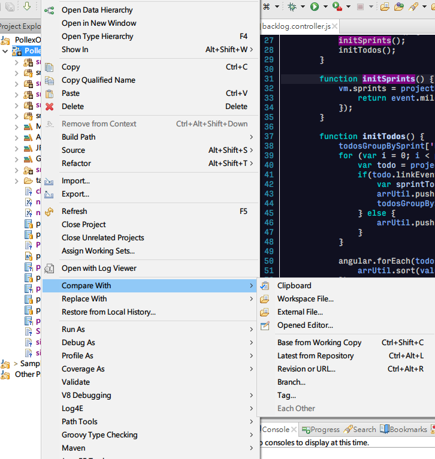

# Eclipse IDE #

#### Views


#### Perspectives


#### Compare/Replace Menu


#### Team/SVN Menu


#### Project Setting


#### Project Setting - Java Build Path


#### Search


# Eclipse Preference #

#### Fonts and Colors


#### Editor Quick Diff


#### Common Text Editor


#### SVN Label Decorations


#### Workspace


### Local History


#### Text Compare View Settings


#### Editor Annotations


#### SVN Label Decorations


#### Shortcut/Hot Keys


#### Java Templates (Snippets)


# Common Command Keys / Shortcuts #

#### Navigation ####
```
	f3                     : Open Declaration
	*alt+f3                : Open Implementation
	ctrl+o                 : Quick Outline
	ctrl+shift+r (*ctrl+p) : Open Resource/File
	ctrl+shift+t           : Open Java File
	ctrl+t                 : Quick Java Type Hierarchy
	f4                     : Open Java Type Hierarchy
	ctrl+alt+h             : Open Call Hierarchy
	ctrl+q                 : Last Edit Location
	ctrl+f6 (*ctrl+tab)    : Next Editor
	*ctrl+shift+alt+r      : Run the tests of selected member
```

#### Editing text ####
```
	alt+/                  : Content Assist
	*alt+'                 : Content Assist (Template Proposals)
	*alt+d alt+d           : Delete Lines
	*alt+d alt+c           : Copy Lines
	alt+down (*ctrl+down)  : Move Lines Down
	alt+up (*ctrl+up)      : Move Lines Up
	ctrl+backspace         : Delete Previous Word
```

