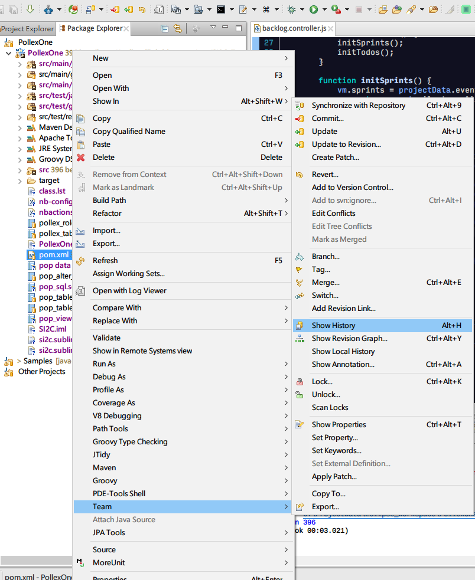

# Eclipse IDE #

#### Views

#### Perspectives

#### Compare/Replace Menu

#### Team/SVN Menu

#### Project Setting

#### Project Setting - Java Build Path

#### Search

#### Help Center - Tips and Tricks
You shall walk around Help Center to explore something you don't know about Eclipse, expecially in the section of "*What's new*" and "*Tips and tricks*". It's very good start from here when new to Eclipse.

# Eclipse Preference #

#### Fonts and Colors

#### Editor Quick Diff

#### Common Text Editor

#### SVN Label Decorations

#### Workspace

### Local History

#### Text Compare View Settings

#### Editor Annotations

#### SVN Label Decorations

#### Shortcut/Hot Keys

#### Java Templates (Snippets)

