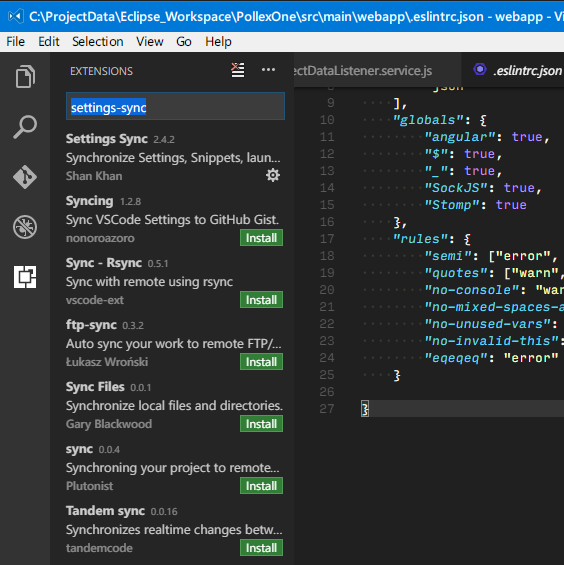
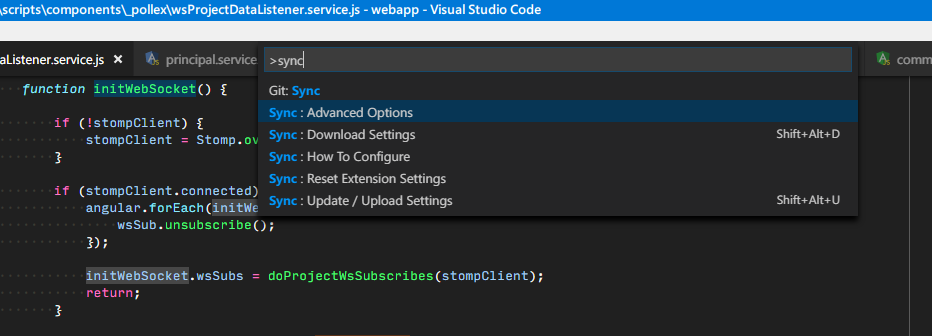
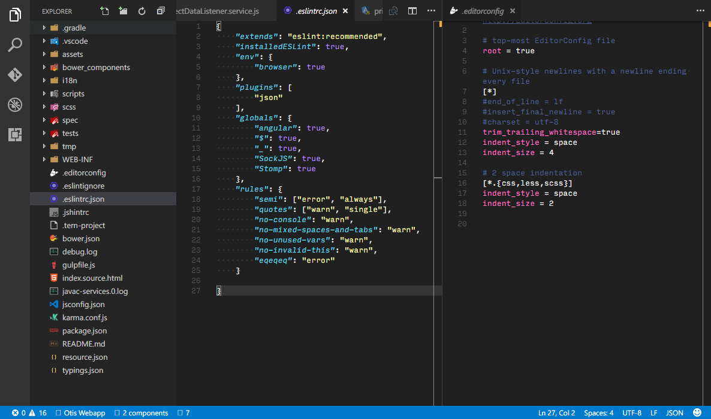

#Installations

##Vscode and "Settings Sync"
1. Get latest version from https://code.visualstudio.com/

2. Install the plugin "Settings Sync" from https://marketplace.visualstudio.com/items?itemName=Shan.code-settings-sync


3. Follow the steps of "Settings Sync" to create your own github account token and Gist. (Once done, you can use my setting by
seleting Command __"Sync : Advance Options > Share Settings with Public GIST"__ (click `F1` and input the comment `Sync`), and input my GIST
`92a1a1154369f7b01e1fc1b7d1f6e9a1`)


##Eable eslint

1. npm intall eslint -g

2. install vscode plugin with command `ext install vscode-eslint` https://marketplace.visualstudio.com/items?itemName=dbaeumer.vscode-eslint (if you downloaded my
vscode settings by above step, you have it already)

3. create a .eslintrc configuration file if your project don't have this. You can do this by either running
eslint --init in a terminal or by using the VS Code
command "Create '.eslintrc.json' file". (The below is my eslint configs)


```json
{
    "extends": "eslint:recommended",
    "installedESLint": true,
    "env": {
        "browser": true
    },
    "plugins": [
        "json"
    ],
    "globals": {
        "angular": true,
        "$": true,
        "_": true,
        "SockJS": true,
        "Stomp": true
    },
    "rules": {
        "semi": ["error", "always"],
        "quotes": ["warn", "single"],
        "no-console": "warn",
        "no-mixed-spaces-and-tabs": "warn",
        "no-unused-vars": "warn",
        "no-invalid-this": "warn",
        "eqeqeq": "error"
    }

}
```

##Enable EditorConfig

1. Install the vscode plugin with command `ext install EditorConfig` https://marketplace.visualstudio.com/items?itemName=EditorConfig.EditorConfig (if you downloaded my
vscode settings by above step, you have it already)

2. create a file with name '.editorconfig' under your project. Below is my settings:

```properties
# EditorConfig is awesome: http://EditorConfig.org

# top-most EditorConfig file
root = true

# Unix-style newlines with a newline ending every file
[*]
#end_of_line = lf
#insert_final_newline = true
#charset = utf-8
trim_trailing_whitespace=true
indent_style = space
indent_size = 4

# 2 space indentation
[*.{css,less,scss}]
indent_style = space
indent_size = 2

```
